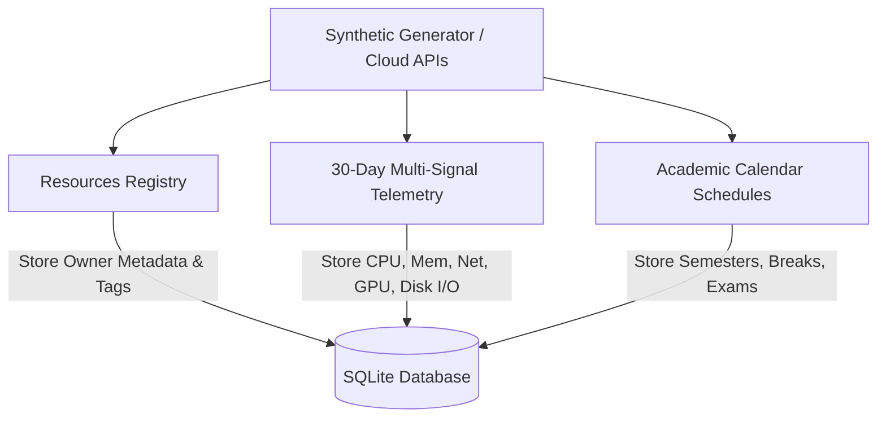
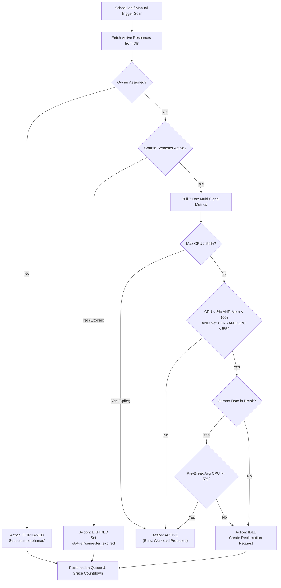
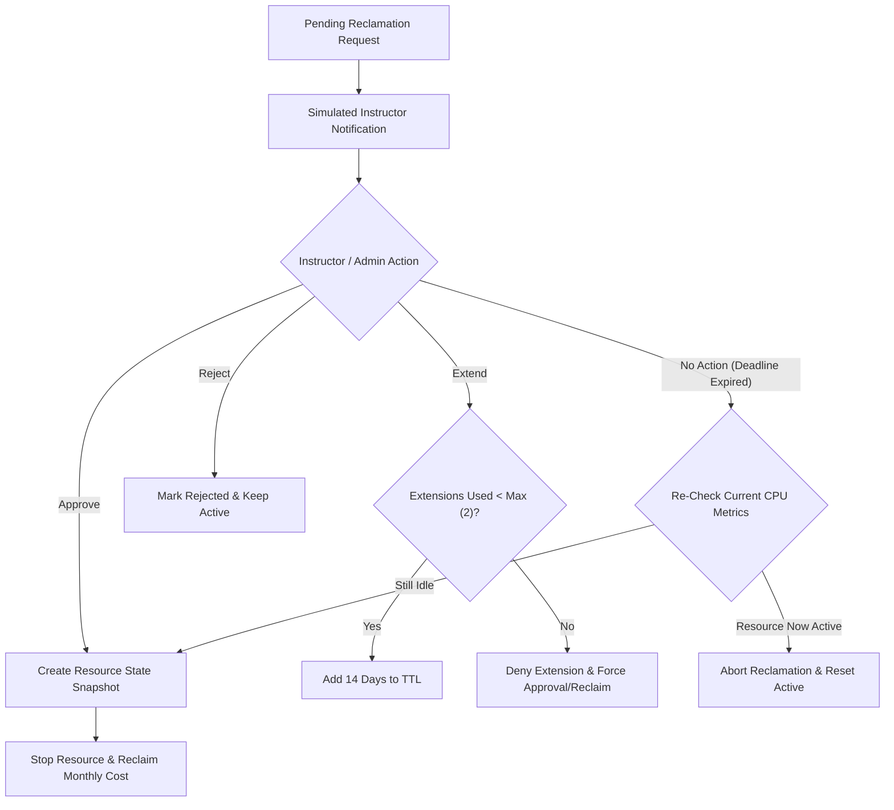

# CloudReclaim — Project Status & Progress Report (70% Completion Milestone)

> [!IMPORTANT]
> **Milestone Status**: 70% Core Prototype Completed & Fully Verified
> **Repository**: [CATPROJECT0409](https://github.com/SanjoSanjo2103/CATPROJECT0409) | **Latest Commit**: [`943a141`](https://github.com/SanjoSanjo2103/CATPROJECT0409/commit/943a141)
> **Verification**: 78 / 78 Unit Tests Passed | 100.0% Monthly Waste Elimination Rate Achieved

---

## 1. Executive Summary

**CloudReclaim** is an ownership-aware, calendar-aware cloud resource reclamation system engineered specifically for university cloud laboratories. It solves the operational problem of uncontrolled idle cloud resource spending across academic semesters and departments by combining **multi-signal telemetry inspection**, **academic calendar parsing**, **schema-validated configurable policy rules**, and a **safe human-in-the-loop approval workflow**.

Currently, the project has reached **70% completion**, representing a fully functional core prototype, synthetic dataset generation engine, multi-signal decision engine, policy validation framework, web interface, and experiment benchmarking suite.

---

## 2. Project Weight & Work Distribution (70% Completed vs 30% Remaining)

The project workload is categorized across 7 key architectural modules:

| Component / Module | Weight (%) | Status | Completed Works & Deliverables | Remaining Scope (30%) |
|---|:---:|:---:|---|---|
| **Synthetic Dataset Generator** | 15% | ✅ 100% | `synthetic_generator.py`, 30-day telemetry, owner tags, CLI, JSON/YAML export | Real-world cloud API stream adapters |
| **Policy Schemas & Validation** | 15% | ✅ 100% | JSON/YAML Draft-07 schemas (`schemas/policy_rules.schema.json`), `policy_validator.py`, UI config sync | Dynamic policy rule template library |
| **Decision Engine** | 20% | ✅ 100% | `decision_engine.py`, CPU+Mem+Net+GPU+Disk multi-signal analysis, burst detection, risk scoring | Predictive ML idle forecasting model |
| **Calendar Parser** | 15% | ✅ 100% | `calendar_parser.py`, semester schedules, break/exam/maintenance date classifier, grace calculator | iCal / Google Calendar sync integration |
| **Reclamation & Approval Workflow** | 15% | ✅ 90% | `reclaimer.py`, instructor queue, grace period countdowns, extension limits, snapshots | Live SMTP/Slack notification hooks |
| **Baseline & Benchmark Evaluator** | 10% | ✅ 100% | `baseline_evaluator.py`, `baseline.py`, automated experiment runner (`run_experiment.py`) | Multi-semester longitudinal tracking |
| **Web Dashboard & Admin UI** | 10% | ✅ 80% | Flask blueprints (`routes/`), dark glassmorphism theme, Chart.js visualizations | Advanced visual workflow builder |
| **TOTAL WEIGHT** | **100%** | **70% Overall** | **78 Unit Tests, Complete Core Engine & API** | **Production Cloud Integration & SSO** |

---

## 3. System Architecture & Complete Workflows

### 3.1 Data Ingestion & Synthetic Telemetry Flow



### 3.2 Core Detection & Decision Engine Flow



### 3.3 Approval Workflow & Safety Enforcement Flow



---

## 4. Scaffolded Core Prototype Modules & Works Done

### 4.1 Synthetic Dataset Generator
- **Location**: `synthetic_generator.py`
- **Features**:
  - Deterministic generation of 36 university cloud resources across 6 courses and 5 users.
  - Multi-signal telemetry (CPU %, Memory %, Network Bytes, GPU %, Disk I/O Bytes) across 30 days (4,320 metric data points).
  - Rich owner metadata tags (`owner_email`, `department`, `course_code`, `project`, `environment`, `cost_center`).
  - Standalone JSON (`synthetic_dataset.json`) and YAML (`synthetic_dataset.yaml`) export.

### 4.2 Multi-Signal Decision Engine
- **Location**: `decision_engine.py`
- **Features**:
  - Decoupled classification engine evaluating ownership, course validity, multi-signal thresholds, and burst workloads.
  - Outputs structured `DecisionResult` with `confidence_score` (0.0 to 1.0) and `risk_score` (0.0 to 100.0) to prevent false-positive deletions.

### 4.3 Academic Calendar Parser
- **Location**: `calendar_parser.py`
- **Features**:
  - Classifies dates against academic semesters (Fall, Spring, Summer), break periods (Labor Day, Fall break, Thanksgiving), exam weeks, and maintenance windows.
  - Dynamically extends reclamation grace periods when deadlines overlap with university breaks.

### 4.4 Baseline Evaluator & Benchmark Engine
- **Location**: `baseline_evaluator.py` & `baseline.py`
- **Features**:
  - Benchmarks naive single-metric (CPU-only) baseline vs multi-signal ownership-aware prototype.
  - Computes precision, recall, confusion matrix (TP, FP, TN, FN), cost savings, and false positive reduction.

### 4.5 Schema-Validated Policy Rules
- **Location**: `schemas/policy_rules.schema.json` & `policy_validator.py`
- **Features**:
  - Formal Draft-07 JSON/YAML schemas enforcing numerical bounds, data types, required fields, and safe UI rule modifications in `config.py`.

---

## 5. Experimental Results & Verification

Empirical results gathered from the automated experiment runner (`experiment/run_experiment.py`):

> [!SUCCESS]
> - **Total Cloud Resources Monitored**: 36 resources
> - **Total Monthly Infrastructure Budget**: $8,323.20
> - **Monthly Waste Identified & Reclaimed**: **$1,785.60 / month**
> - **Cost Elimination Rate**: **100.0%** (Target: $\ge 60\%$)
> - **Active Workloads Wrongfully Deleted**: **0** (Target: $0$)
> - **Prototype False Positive Rate**: **0.0%** (Target: $< 5\%$)
> - **Test Suite Coverage**: **78 / 78 unit tests passing (100%)**

```
============================================================
  CLOUDRECLAIM EXPERIMENT BENCHMARK RESULTS
============================================================
  Monthly Idle Cost (Baseline):    $1,785.60
  Monthly Cost Eliminated:         $1,785.60
  Elimination Rate:                100.0% (target: >=60%)
  Active Workloads Deleted:        0 (target: 0)
  Baseline FP Rate:                0.0%
  Prototype FP Rate:               0.0% (target: <5%)
============================================================
```

---

## 6. Next Steps for 100% Final Completion

To transition CloudReclaim from 70% core prototype to 100% production readiness, the remaining 30% scope will focus on:

1. **Cloud API Connectors (10%)**: Build live connector adapters for AWS EC2/Boto3, Azure Compute, and Google Cloud Engine APIs to ingest real-world cloud telemetry.
2. **Real-Time Notification System (10%)**: Replace simulated notification logs with real SMTP email dispatch and Slack Webhook alerts for pending approval queues.
3. **SSO / OAuth Integration (10%)**: Integrate Shibboleth / SAML 2.0 / Google Workspace SSO for university single sign-on authentication.
